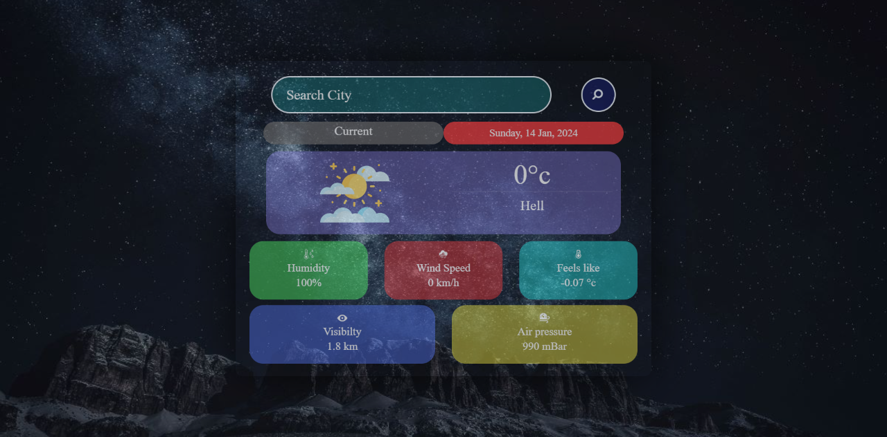

# weather webApp

A simple weather App using HTML, CSS and JAVASCRIPT fetching weather informations and users current weather update through geolocation.

#### Get free weather APIs from openweathermap :-  
##### [openweathermap.org](https://openweathermap.org/)
### screenshot

#### Demo
###### see on the web browser :- [Weather webapp](https://errorbyme.github.io/weather-webapp/)

